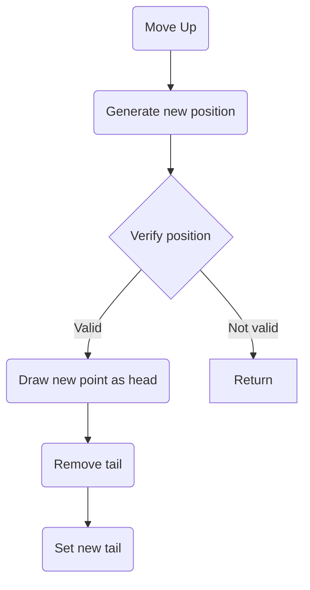

```mermaid
flowchart TD
    Up(Move Up) --> P(Generate new position)
    P --> VP{Verify position}
    VP --> |Valid| NH(Draw new point as head)
    VP --> |Not valid| Return
    NH --> RT(Remove tail)
    RT --> NT(Set new tail)
```
